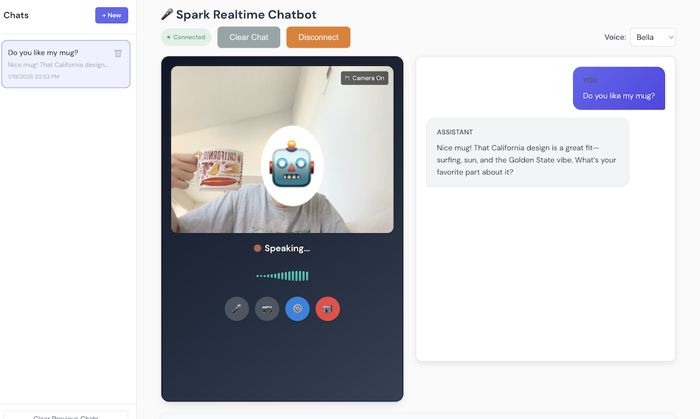

# spark-realtime-chatbot

A voice and vision AI assistant running locally on DGX Spark — streaming speech recognition, vision-language models, and text-to-speech, all on a single GB10.



**Highlights:**
- **Ultra-low latency**: ~320ms voice calls, ~850ms video calls (end-to-end)
- **Runs entirely on-device**: No cloud APIs required
- **Vision + Voice**: Video calls with real-time scene understanding (Qwen3-VL)
- **Face Recognition**: Enroll and identify users on the fly
- **GB10-optimized**: ASR, LLM, TTS, and vision all running on GPU

**Performance on DGX Spark:**
| Component | Latency | RTF |
|-----------|---------|-----|
| ASR (faster-whisper) | ~200ms | 0.07x |
| LLM (Qwen3-VL text) | ~65ms TTFT | — |
| VLM (Qwen3-VL vision) | ~600ms | — |
| TTS (Kokoro) | ~50ms | 0.03x |

*End-to-end: ~320ms voice calls, ~850ms video calls*

## Quick Start (Docker)

Docker is the recommended way to run this project. The container includes all dependencies pre-built for DGX Spark's GB10 (CUDA 13.0, sm_121).

### 1. Setup llama.cpp

Build llama.cpp from source. See [llama.cpp build instructions](https://github.com/ggerganov/llama.cpp/blob/master/docs/build.md) for details.

Download the models:

```bash
# Qwen3-VL (Vision Language Model)
curl -L -o Qwen3VL-30B-A3B-Instruct-Q4_K_M.gguf \
    https://huggingface.co/Qwen/Qwen3-VL-30B-A3B-Instruct-GGUF/resolve/main/Qwen3VL-30B-A3B-Instruct-Q4_K_M.gguf

curl -L -o mmproj-Qwen3VL-30B-A3B-Instruct-Q8_0.gguf \
    https://huggingface.co/Qwen/Qwen3-VL-30B-A3B-Instruct-GGUF/resolve/main/mmproj-Qwen3VL-30B-A3B-Instruct-Q8_0.gguf

# Nemotron (Reasoning Model, optional)
curl -L -o Nemotron-3-Nano-30B-A3B-Q4_K_M.gguf \
    https://huggingface.co/unsloth/Nemotron-3-Nano-30B-A3B-GGUF/resolve/main/Nemotron-3-Nano-30B-A3B-Q4_K_M.gguf
```

### 2. Start LLM Servers

Start the LLM servers on the host in separate terminals:

**Terminal 1 - VLM (Vision Language Model):**
```bash
./llama-server -m Qwen3VL-30B-A3B-Instruct-Q4_K_M.gguf \
    --mmproj mmproj-Qwen3VL-30B-A3B-Instruct-Q8_0.gguf \
    --host 0.0.0.0 --port 8080 \
    -ngl 99 -c 8192 --threads 8 --threads-http 8 -fa on --cache-reuse 256
```

**Terminal 2 - Nemotron (Reasoning Model, optional):**
```bash
./llama-server -m Nemotron-3-Nano-30B-A3B-Q4_K_M.gguf \
    --host 0.0.0.0 --port 8005 \
    -ngl 99 -c 32768 --threads 8 --threads-http 8 -fa on --cache-reuse 256
```

### 3. Build and Run

```bash
# Clone the repository
git clone https://github.com/kedarpotdar-nv/spark-realtime-chatbot
cd spark-realtime-chatbot

# Build the Docker image
docker build -t spark-realtime-chatbot .

# Run (first time - downloads models)
docker run --gpus all --net host -it --init \
    -v ~/.cache/huggingface:/root/.cache/huggingface \
    -e HF_TOKEN=<your_hf_token> \
    spark-realtime-chatbot

# Run (subsequent - offline mode)
docker run --gpus all --net host -it --init \
    -v ~/.cache/huggingface:/root/.cache/huggingface \
    -e HF_HUB_OFFLINE=1 \
    spark-realtime-chatbot
```

### 4. Open the App

Navigate to **https://localhost:8443** in your browser.

Since it's HTTPS, you can also access remotely via your Spark's IP: `https://<spark-ip>:8443`

---

## Local Development (Python)

For development or non-Docker environments:

### 1. Prerequisites

- Python 3.10+
- ffmpeg: `sudo apt install ffmpeg`

### 2. Setup

```bash
# Clone the repository
git clone https://github.com/kedarpotdar-nv/spark-realtime-chatbot
cd spark-realtime-chatbot

# Create virtual environment
python -m venv venv
source venv/bin/activate

# Install dependencies
pip install -r requirements.txt
```

### 3. Start Services

**ASR Server** (if not using local ASR):
```bash
docker run --gpus=all --net host \
    -v ~/.cache/huggingface:/root/.cache/huggingface \
    fedirz/faster-whisper-server:latest-cuda
```

**LLM Servers** - see steps 1-2 in Docker quickstart above.

### 4. Launch

```bash
# HTTPS (recommended - required for microphone access)
./launch-https.sh

# With local ASR (lower latency, no separate ASR server needed)
./launch-https.sh --local-asr

# With TTS overlap (experimental - starts TTS while LLM streams)
./launch-https.sh --local-asr --tts-overlap
```

Open **https://localhost:8443** in your browser.

---

## Configuration

Key environment variables (pass to Docker with `-e` or set before launching):

| Variable | Default | Description |
|----------|---------|-------------|
| `LLM_SERVER_URL` | `http://localhost:8080/v1/chat/completions` | LLM/VLM endpoint |
| `NEMOTRON_SERVER_URL` | `http://localhost:8005/v1/chat/completions` | Reasoning model endpoint |
| `ASR_MODEL` | `Systran/faster-distil-whisper-large-v3` | Whisper model for ASR |
| `KOKORO_VOICE` | `af_bella` | TTS voice (`af_bella`, `af_heart`, etc.) |

See `config.py` for all available options.

---

## Usage

1. **Connect**: The app auto-connects on load
2. **Choose Mode**: Voice call or video call
3. **Voice Input**: Hands-free with auto voice detection, or hold SPACE for push-to-talk
4. **Enable Tools**: Check agents in the sidebar (reasoning assistant, markdown assistant)
5. **Face Recognition**: Use video call mode to enroll/recognize faces

---

## Try It

**Whiteboard to README**
- Draw a system diagram on a whiteboard or paper
- Start a video call and show it to the camera
- Say: *"Convert this whiteboard into a markdown README"*

**Architecture Review**
- Sketch a system architecture diagram
- Show it to the camera and ask: *"How can I improve this architecture?"*
- Or: *"What's missing from this design?"*

**Fashion Advisor**
- Start a video call
- Ask: *"Am I dressed appropriately for a board meeting?"*
- Or: *"What should I wear to a job interview?"*

**Face Recognition**
- In video call mode, say: *"Remember my face as [your name]"*
- End the call, start a new one
- The bot will greet you by name

---

## Architecture

This is a reference low-latency pipeline meant to be extended as needed.

```
Browser ──► FastAPI Server ──► llama.cpp (Qwen3-VL, Nemotron)
                │
                ├── ASR (faster-whisper)
                ├── TTS (Kokoro)
                └── Face Recognition (DeepFace)
```

Key files:
- `server.py` - FastAPI backend with WebSocket handlers
- `clients/` - ASR, LLM, TTS, VLM, face recognition clients
- `static/` - Frontend (HTML/JS/CSS)
- `tools.py` - Tool definitions
- `prompts.py` - System prompts

---

## Acknowledgements

This project builds on these amazing open-source projects:

- [llama.cpp](https://github.com/ggerganov/llama.cpp) - LLM/VLM inference engine
- [Qwen3-VL](https://github.com/QwenLM/Qwen2.5-VL) - Vision Language Model (Alibaba)
- [Nemotron](https://huggingface.co/nvidia/Llama-3.1-Nemotron-Nano-8B-v1) - Reasoning model (NVIDIA)
- [faster-whisper](https://github.com/SYSTRAN/faster-whisper) - ASR (SYSTRAN)
- [CTranslate2](https://github.com/OpenNMT/CTranslate2) - Inference engine (OpenNMT)
- [Kokoro](https://github.com/hexgrad/kokoro) - Text-to-Speech
- [DeepFace](https://github.com/serengil/deepface) - Face recognition
- [Silero VAD](https://github.com/ricky0123/vad) - Voice Activity Detection
- [spaCy](https://spacy.io/) - NLP processing


